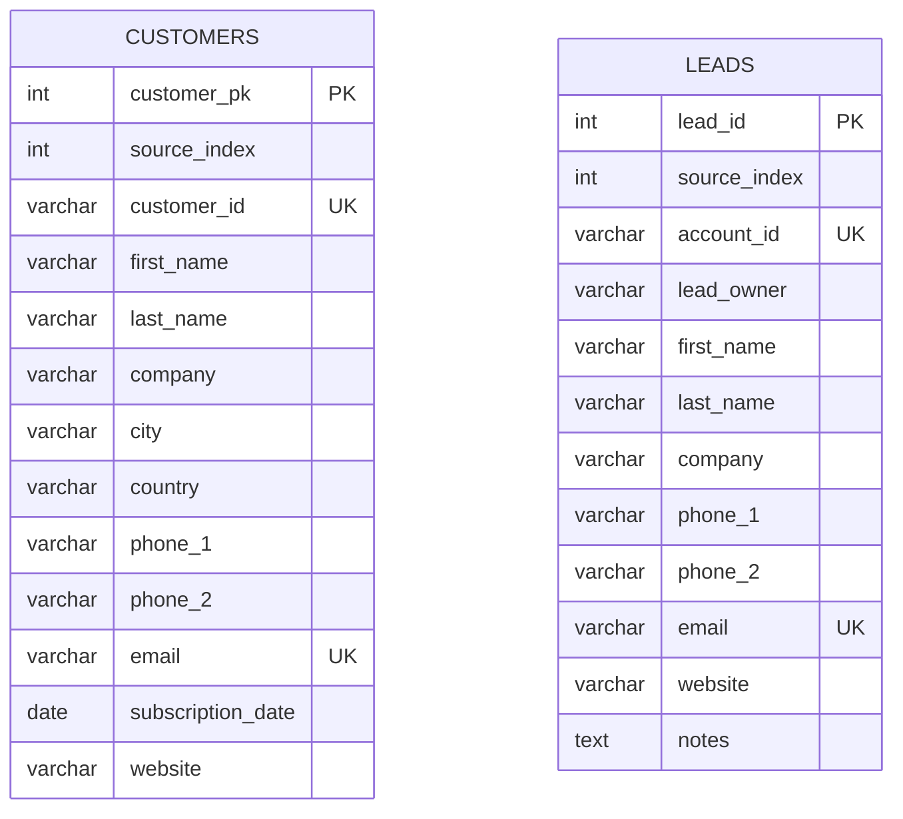
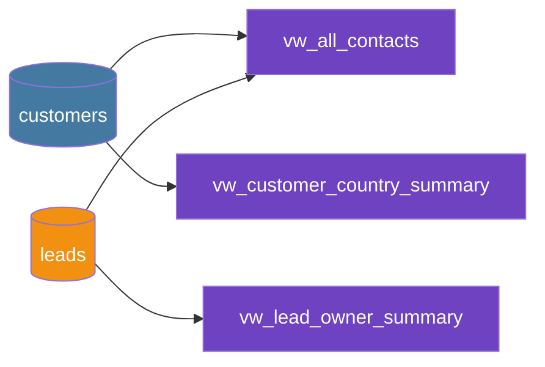

<div align="center">

# 📇 Contacts Database: Customers & Leads

### A hands-on MySQL project: schema design, indexes, views, and 10 practice queries


</div>

---

## 📑 Table of Contents

- [✨ Overview](#-overview)
- [🗂️ Project Structure](#️-project-structure)
- [🧱 Database Design](#-database-design)
- [🚀 Quick Start](#-quick-start)
- [🧠 Practice Questions](#-practice-questions)
- [🛠️ Skills Demonstrated](#️-skills-demonstrated)
- [📝 Notes](#-notes)
- [🤝 Contributing](#-contributing)

---

## ✨ Overview

This project models a simple **CRM-style contact system** with two datasets:

| Dataset | Rows | What it represents |
|---------|-----:|--------------------|
| 👥 **Customers** | 100 | Paying customers with location, subscription date, and contact info |
| 🎯 **Leads** | 1,000 | Prospects, each assigned to a lead owner, with sales notes |

It includes **indexes** for faster lookups, **three views** for reporting, and a set of **10 progressively harder SQL questions** with solutions, ideal for learning or interview prep.

---

## 🗂️ Project Structure

```text
📦 sql-contacts-project
 ┣ 📜 01_schema_and_data.sql        ← Main file: tables, data, indexes, views
 ┣ 📜 02_questions_and_answers.sql  ← 10 questions + solutions
 ┣ 📄 questions.md                  ← Questions only (try them yourself!)
 ┗ 📄 README.md                     ← You are here
```

---

## 🧱 Database Design

### Entity diagram



### How the views are built



| View | Description |
|------|-------------|
| `vw_all_contacts` | Leads + customers merged with `UNION ALL`, tagged by `record_type` |
| `vw_lead_owner_summary` | Number of leads per owner, highest first |
| `vw_customer_country_summary` | Number of customers per country, highest first |

<details>
<summary>⚡ <b>Indexes included (click to expand)</b></summary>

| Table | Indexed columns |
|-------|-----------------|
| `leads` | `email`, `company`, `lead_owner`, `(first_name, last_name)` |
| `customers` | `email`, `company`, `country`, `subscription_date`, `(first_name, last_name)` |

</details>

---

## 🚀 Quick Start

**1️⃣ Clone the repo**

```bash
git clone https://github.com/<your-username>/<your-repo>.git
cd <your-repo>
```

**2️⃣ Build the database**

```bash
mysql -u <user> -p < 01_schema_and_data.sql
```

**3️⃣ Run the solutions**

```bash
mysql -u <user> -p < 02_questions_and_answers.sql
```

> 💡 Prefer a GUI? Open both files in **MySQL Workbench** and run them in order.

**4️⃣ Quick sanity check**

```sql
USE `Transaction`;
SELECT record_type, COUNT(*) FROM vw_all_contacts GROUP BY record_type;
-- Expected: customer = 100, lead = 1000
```

---

## 🧠 Practice Questions

Try them on your own first (see [`questions.md`](questions.md)), then compare with [`02_questions_and_answers.sql`](02_questions_and_answers.sql).

| # | Topic | Difficulty | Key concepts |
|:-:|-------|:----------:|--------------|
| 1 | Customers from Canada | 🟢 Easy | `WHERE`, `ORDER BY` |
| 2 | Top 5 countries by customers | 🟢 Easy | `GROUP BY`, `LIMIT` |
| 3 | Customers per subscription year | 🟢 Easy | `YEAR()`, aggregation |
| 4 | Lead owner with most leads / owners with one lead | 🟡 Medium | `HAVING`, subqueries |
| 5 | Companies containing "Group" or "LLC" | 🟡 Medium | `LIKE`, conditional counts |
| 6 | Contacts by record type | 🟢 Easy | views, `GROUP BY` |
| 7 | Top 5 email domains | 🟡 Medium | `SUBSTRING_INDEX` |
| 8 | Contacts with missing website | 🟡 Medium | `NULL` handling, views |
| 9 | Subscriptions in H2 2021 | 🟢 Easy | date ranges, `BETWEEN` |
| 10 | Leads mentioning "government" at Inc/PLC firms | 🟠 Challenging | multiple conditions, `LOWER()` |

<details>
<summary>👀 <b>Sneak peek: Question 7 solution</b></summary>

```sql
-- Top 5 most common customer email domains
SELECT
    SUBSTRING_INDEX(email, '@', -1) AS email_domain,
    COUNT(*) AS total_customers
FROM customers
GROUP BY email_domain
ORDER BY total_customers DESC, email_domain ASC
LIMIT 5;
```

</details>

---

## 🛠️ Skills Demonstrated


- Relational schema design with primary and unique keys
- Index creation for common search columns
- Reporting views, including a `UNION ALL` of two tables
- Pattern matching, string parsing, and date filtering
- Writing tie-safe, deterministic queries

---

## 📝 Notes

- 🧪 All data is **sample/synthetic**; it does not represent real people or companies.
- Q4 is interpreted as: (a) owner(s) with the most leads, and (b) number of owners with exactly one lead.
- Q8 treats empty-string websites as missing in addition to `NULL`.
- Tested on **MySQL 8.x**. `SUBSTRING_INDEX` and `YEAR()` are MySQL-specific; other engines need small changes.

---

## 🤝 Contributing

Ideas and improvements are welcome:

1. 🍴 Fork the repo
2. 🌿 Create a branch (`git checkout -b feature/new-questions`)
3. 💾 Commit your changes
4. 📬 Open a pull request

Good first contributions: extra practice questions, solutions for PostgreSQL / SQL Server, or `JOIN` exercises.

---

<div align="center">

⭐ **If this project helped you, consider giving it a star!** ⭐

</div>
